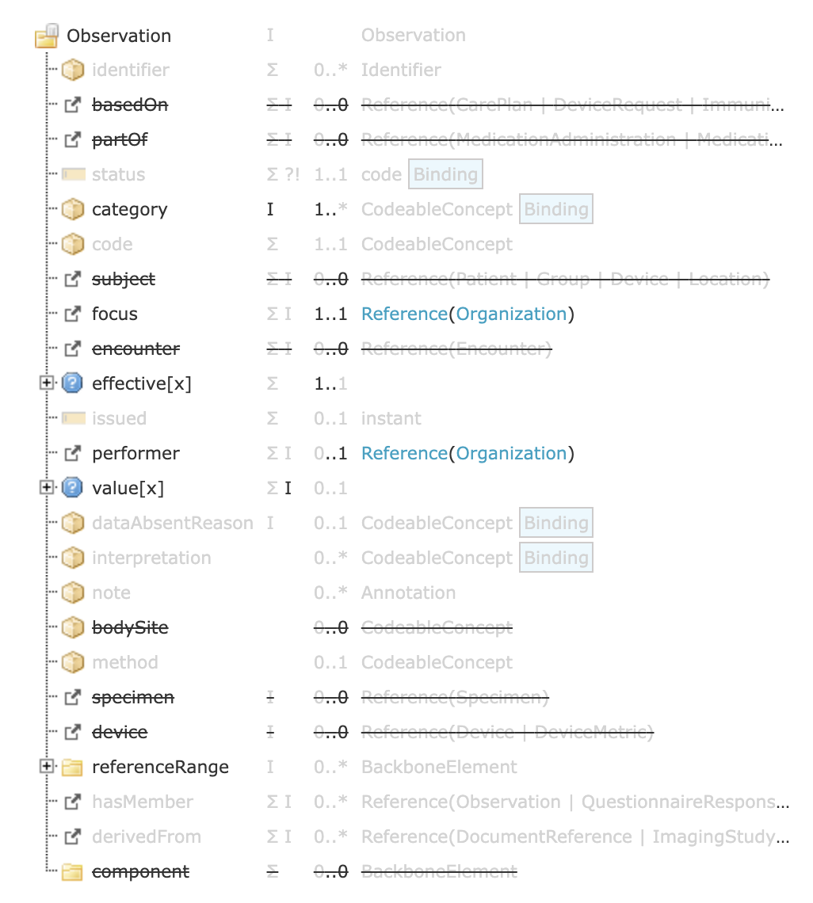

# Dotbase: Digital Health Casestudy

## KPI FHIR profile

For Profiling FHIR Ressouces it is best to use the [Kodijin FHIR Profiler](https://profiler.kodjin.com/)

There you can see the created ressource in a Split pane.

The following is a list of fields that are used for representing a KPI.

|     Key     |   Type   | Description                     |
| ----------- | -------- | ------------------------------- |
|    code     | [CodableConcept](https://www.hl7.org/fhir/datatypes.html#CodeableConcept) |[LOINC Code](hl7.org/fhir/valueset-observation-codes.html) Identifying the Ressource | 
| valueQuantity | [Quantity](https://www.hl7.org/fhir/datatypes.html#Quantity) | Value of the KPI |
| dataAbsentReason | [CodableConcept](https://www.hl7.org/fhir/datatypes.html#CodeableConcept) | Description if the value of the KPI is empty - could be because it couldn't be computed |
| subject | [Reference](https://www.hl7.org/fhir/references.html#Reference)([Organization](https://www.hl7.org/fhir/organization.html)) | The Organization that KPI is observed on |
| performer | [Reference](https://www.hl7.org/fhir/references.html#Reference)([Organization](https://www.hl7.org/fhir/organization.html)) | The Organization that calculated the KPI |
| effectivePeriod | [Period](https://www.hl7.org/fhir/datatypes.html#Period) | The Period the KPI value is measured for |
| referenceRange | - | Reference Range (example: baseline, maximum, minimum) TODO!

